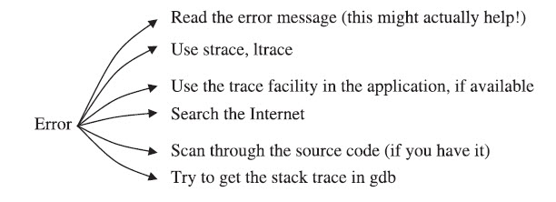
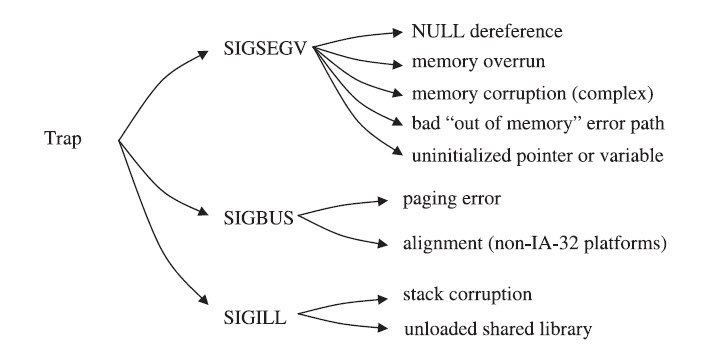
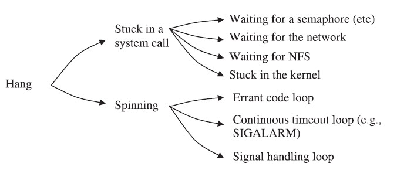

# Best Practices and Initial Investigation

### 1. Linux Tools needed for investigation
  - strace
  - ltrace
  - gdb
  - lsof
  - ping
  - tcpdump
  - htop
  - traceroute/tcptraceroute
  - ping
  - hexdump
  - tcpdump
  - readelf
  
### 2. The 4 Phases of Investigation
 
Good investigation practices should balance the need to solve problems quickly,the need to build your skills, and the effective use of subject matter experts.

1. Initial investigation using your own skills.
Basic information that is needed to investigate any problem are
  - The exact time the problem occurred
  - Dynamic operating system information (information that can change frequently over time without any human intervention, such CPU utilization, mem usage etc)
    The following questions needs to be answered in order to find out more about the problem being investigated.
      - <b>What you were doing when the problem occurred.</b> Were you installing oftware? Were you trying to start a Web server?
      - <b>A problem description.</b> This should include a description of what appened and a description of what was supposed to happen. In other words,how do you know there was a problem?
      - <b>Anything that may have triggered the problem.</b> This will be pretty roblem-specific, but it’s worthwhile to think about it when the problem is till fresh in your mind.
      - <b>Any evidence that may be relevant.</b> This includes error logs from an pplication that you were using, the system log (/var/log/messages), an error essage that was printed to the screen, and so on. You will want to protect ny evidence (that is, make sure the relevant files don’t get deleted until you solve the problem).
  
2. Search for answers using the Internet or other resource.

3. Begin deeper investigation.

        1.Collect relevant information when the problem occurs.
            1.1 The exact time the problem occurred
            1.2 Dynamic operating system information
            1.3 What you were doing when the problem occurred
            1.4 A problem description
            1.5 Anything that may have triggered the problem
            1.6 Any evidence that may be relevant
            
        2. Keep a log of what you’ve done and what you think the problem might be.
        3. Be detailed and avoid qualitative information.
        4. Challenge assumptions until they are proven.
        5. Narrow the scope of the problem.
        6. Work to prove or disprove theories about the problem.
    
3. Ask a subject matter expert for help.

### Technical Investigation
Problem investigations always start with a symptom. Symtoms can be a hint and can also be misleading. There are five categories of symptoms listed below, each of which has its own methods of investigation.

1. Error

  
  
2. Crash - occur because of severe conditions and fit into two main categories: traps and panics. 
      - Trap usually occurs when an application references memory incorrectly, when a bad instruction is executed, or when there is a bad “page-in” (the process of bringing a page from the swap area into memory).
      - Panic in an application is due to the application itself abruptly shutting down due to a severe error condition.

The main difference the two is that a trap is a crash initiated by the OS or the hardware and a panic is an application shutting down due to severe error condition.

  
  
  The most important information to gather when the kernel experiences a major problem 
   1. <b>The instruction that trapped.</b> The instruction can tell you a lot about the type of trap. If the instruction is invalid, it will generate a SIGILL. If the instruction references memory and the trap is a SIGSEGV, the trap is likely due to referencing memory that is outside of a memory region (/proc directory contains more information on process memory maps.)

   2. <b>The function name and offset of the instruction that trapped.</b> This can be obtained through GDB or using the load address of the shared library and the instruction address itself.

   3. <b> The Stack trace </b>

   4. <b> The register dump. </b> It can help us to understand the context under which the trap occured.

   5. <b> A Core file or a memory dump. </b>

Some applications use a special function called a “signal handler” to generate information about a trap that occurred.

3. Hang (or very slow performance)

     
     
4. Performance

5. Unexpected behavior/output
