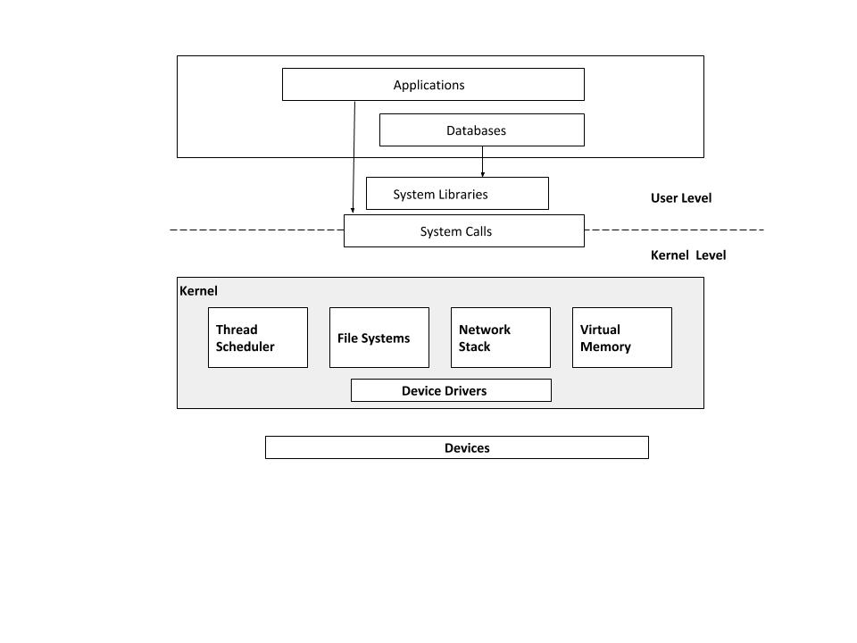

#Introduction

This chapter introduces <b>systems performance</b>, describing roles,activities,perspectives and challenges.

#### 1.1. System Performance
- Is the study of the whole system, including all hardware and software stack. Anything in the data path, software or hardware can
  affect performance. For distributed systems this means that multiple servers and applications needs to be included in the study.

#### 1.2 Roles
- Performance Engineer whose primary activity is systems performance are normally best suited to perform holistic stidy of the environment
  in order to diagnose complex performance issues.
  
#### 1.3 Activities
1. Setting performance objectives and modeling.
2. Performance charecterization of prototype software or hardware.
3. Performance analysis of development code
4. Performing non-regression testing of software builds, pre and post release.
5. Benchmarking software releases.
6. Configuration optimozation for production deployment.
7. Proof-of-Concept testing in the target environment.
8. Monitoring and running production software.
9. Performance analysis of issues.

#### 1.4 Perspectives
Performance roles can be viewed from two different perspectives
  1. Workload analysis
  2. Resource analysis

#### 1.5 Performance
Performance is a challenging field since it can be subjective and complex due to interactions between multiple systems, hardware and groups of people having different expectations and expertise.
 
